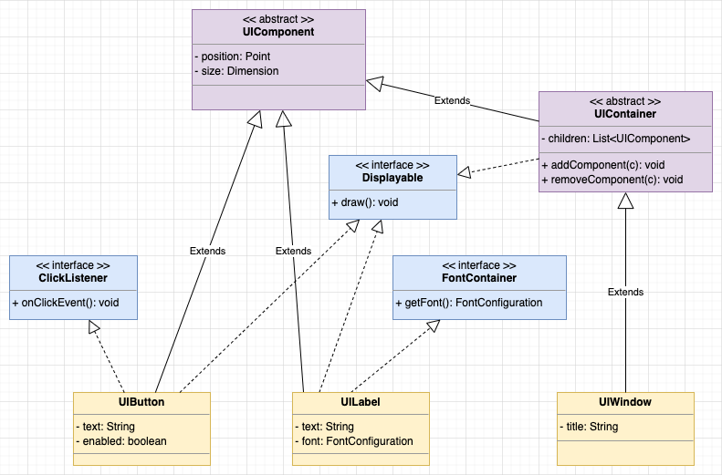
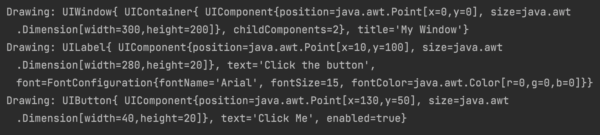
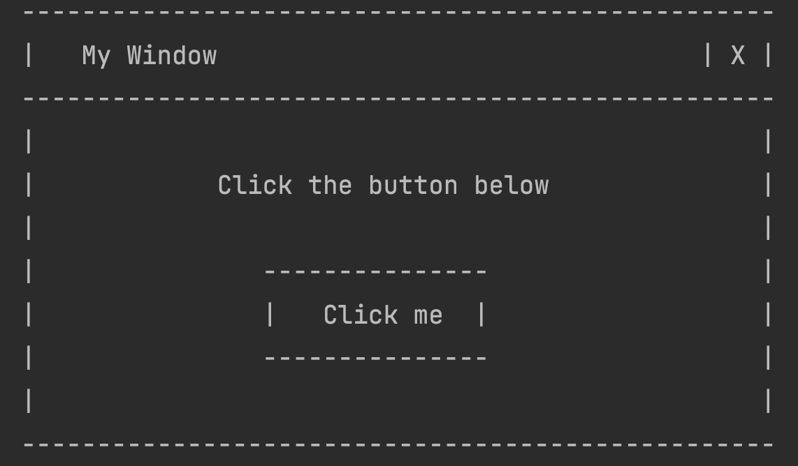

# [OOP 4 - Abstract Classes and Interfaces](https://redi-school.github.io/intermediate-java/oop-4-abstract-classes-and-interfaces/)

## Description

Let's create a simple UI System.

### Classes

- **UIComponent (Abstract)**
  - Defines any component of our UI System
- **UIButton**
  - A button, that can be used for clicks
- **UILabel**
  - A label, that can be used for showing text
- **UIContainer (Abstract)**
  - Defines any UI component that can hold other components inside
- **UIWindow**
  - A window, that can be used for grouping a bunch of components on the screen

### Interfaces

- **Displayable**
  - Anything that can be shown on screen
- **ClickListener**
  - Anything that can handle click events
- **FontContainer**
  - Anything that contains a font configuration

## Tasks
  
### Step 1 - Base class
1. Define an abstract class called `UIComponent`, which will be the base class for all UI components (visual or not)
    1. Property `java.awt.Point position` (private, with getter and setter)
       - Link to [official documentation](https://docs.oracle.com/javase/10/docs/api/java/awt/Point.html) of the Point class
    2. Property `java.awt.Dimension size` (private, with getter and setter)
       - Link to [official documentation](https://docs.oracle.com/javase/10/docs/api/java/awt/Dimension.html) of the Dimension class
    3. A parameterized constructor
    4. Override the `toString` method to print the properties
    
### Step 2 - A button
1. Create a concrete class `UIButton` and make it extend `UIComponent`
    1. Property `String text` (private, with getter and setter)
    2. Property `boolean enabled` (private)
    3. A parameterized constructor, with call to `super`
    4. Behaviours `enable()`, `disable()` and `isEnabled()`
    5. Override the `toString` method to print the properties (also from `super`)
2. Create an interface called `Displayable`
    1. Define a contract method `void draw()`, which can be called from the system to draw the component
    2. Make the `UIButton` class to implement this interface and "draw" something on the console
      - _Suggestion:_ print the output of `this.toString()` in the console inside the `draw` function 
3. Create an interface called `ClickListener`
    1. Define a contract method `void onClickEvent()`, which can be called from the system when the user clicks inside the component
    2. Make the `UIButton` class to implement this interface and react to the event printing something on the console
      - _Hint_: if the button is not enabled, it should ignore the event and not do anything
   
### Step 3 - A label

1. Create a concrete class `UILabel` and make it extend `UIComponent`
   1. Property `String text` (private, with getter and setter)
   2. Property `FontConfiguration font` (private, with getter and setter)
   3. A parameterized constructor, with call to `super`
   4. Override the `toString` method to print the properties (also from `super`)
2. Make the `UILabel` class implement the `Displayable` interface
3. Create an interface called `FontContainer`
   1. Define a contract method `FontConfiguration getFont()`
   2. Make the `UILabel` class implement this interface

### Step 4 - A window

1. Create an abstract class called `UIContainer` (a component which has other components inside)
   1. It should extend `UIComponent`
   2. Property `List<UIComponent> children` (private, with getter and setter)
   3. Parameterized constructor that calls `super` and initializes the list of children as an empty list
      - the list should not be part of the parameters
   4. Behaviours `addComponent(UIComponent c)` and `removeComponent(UIComponent c)`
   5. Override the `toString` method to print the properties (also from `super`)
2. Make the `UIContainer` implement the `Displayable` interface
   1. Define an abstract method called `drawSelf` (protected), to force concrete classes to implement logic to draw themselves
   2. Implement the `draw` method from the interface in a way that it draws itself and all the children
     - First, call the `drawSelf` method
     - After that, iterate over all children
       - If the child component is `Displayable`, call the `draw` method from it
         - _Hint_: You need to use the `instanceof` operator to verify that
3. Create a concrete class called `UIWindow`
   1. It should extend `UIContainer`
   2. Property `String title` (private, with getter and setter)
   3. Parameterized constructor that calls `super`
   4. Override the `toString` method to print the properties (also from `super`)
   5. Implement the required `drawSelf` method defined in the parent class

### Step 5 - Put everything to run :)

1. Inside the `Main` class
   - Create an instance of a `UIWindow`
   - Create an instance of a `UILabel` and add it to the `UIWindow`
   - Create an instance of a `UIButton` and add it to the `UIWindow`
   - Call the `draw` function of the `UIWindow`
     - All elements should be "drawn" on the console, more or less like the example below
     

## Want to know more?
With inheritance, you can do a lot of cool stuff. 

In this exercise, we asked you to implement some classic [Software Design Patterns](https://en.wikipedia.org/wiki/Software_design_pattern). If you want to know more about them, follow the links.
- Step 2 / Task 3 uses a common design pattern called [Observer](https://en.wikipedia.org/wiki/Observer_pattern)
- Step 4 / Task 2.1 uses a common design pattern called [Template Method](https://en.wikipedia.org/wiki/Template_method_pattern)
- Step 4 / Task 2.2 uses a common design pattern called [Composite](https://en.wikipedia.org/wiki/Composite_pattern)

Also, when your system becomes too complex, and you need to represent your design (visually), you can use the [UML (Unified Modeling Language)](https://en.wikipedia.org/wiki/Unified_Modeling_Language) diagrams.

## Want a Challenge?
- Change the application to present a text-based UI, like in the example below
  
